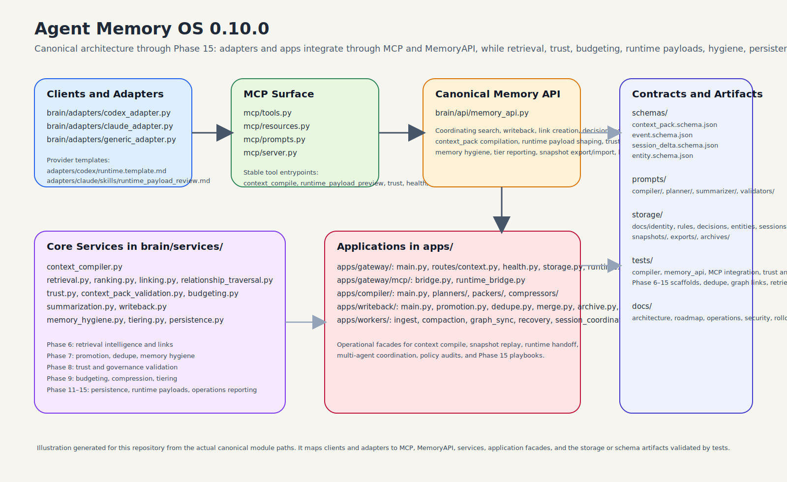
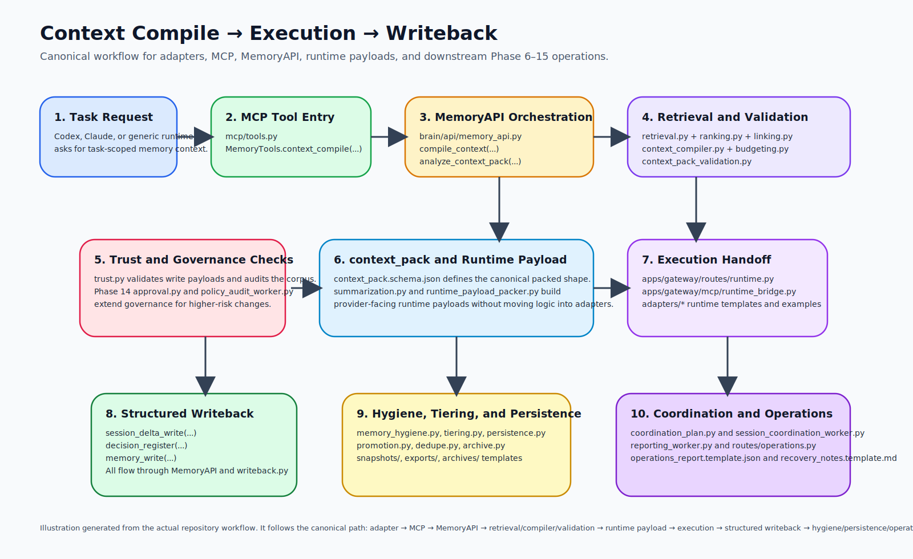
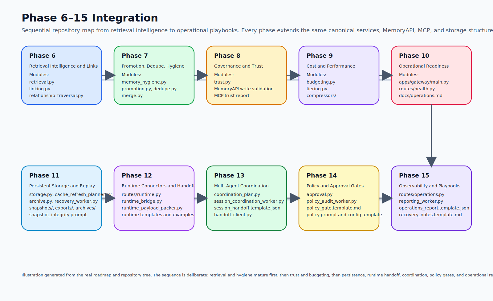

# Agent Memory OS

Version: **0.10.0**  
Status: **startup-ready**  
Release state: **Phase 15 complete**

Agent Memory OS is a shared memory kernel and context operating layer for AI
agents such as Codex, Claude/Cloud, and future generic runtimes. Its purpose is
to make memory canonical, keep prompt-time context compact, and let multiple
agents operate over the same durable substrate without relying on raw chat
history.

The repository is organized around one architectural rule: durable memory,
prompt-time context, runtime handoff, and writeback are separate responsibilities.
Memory is the source of truth. `context_pack` is a compiled projection. Adapters
are thin clients. MCP is the stable integration surface.

---

## Overview

Multi-agent systems usually fail in the same ways:

- important decisions are scattered across tools and sessions
- raw conversation history becomes the default memory layer
- prompt size grows faster than useful context
- different agents get different versions of the same project truth
- writeback is ad hoc, unstructured, or impossible to audit

Agent Memory OS addresses those problems by centralizing:

- structured memory storage
- context compilation under token budget
- link-aware retrieval
- trust-aware write validation
- delta-based writeback
- runtime payload preparation
- hygiene, tiering, persistence, and operational reporting

The result is a memory-first system where agents are replaceable clients of a
shared canonical layer rather than isolated runtimes with fragile local context.

---

## Canonical Architecture

The repository follows a layered model:

1. **Memory is canonical**
   Durable facts, rules, decisions, entities, and session deltas live behind the
   canonical `MemoryAPI`.

2. **Context is compiled**
   Agents do not receive raw history. They receive a compact, schema-shaped
   `context_pack` compiled from relevant memory under a token budget.

3. **Adapters stay thin**
   Codex, Claude, and generic adapters ask MCP for context, perform work, and
   write structured deltas back through the canonical path.

4. **MCP is the universal surface**
   Tools, prompts, and resources are exposed through `mcp/` so transports and
   agent clients integrate through one stable contract.

5. **Writeback is governed**
   Memory writes pass through trust checks, source/status expectations, and later
   policy or approval gates.

6. **Operations remain traceable**
   Hygiene, tiering, snapshots, exports, runtime payloads, and reports all stay
   connected to the same core system instead of becoming side systems.

### Core runtime flow

1. An adapter or app requests context through MCP.
2. MCP delegates to `MemoryAPI`.
3. `MemoryAPI` coordinates retrieval, ranking, linking, budgeting, validation,
   summarization, and trust checks.
4. A schema-compliant `context_pack` is returned.
5. Optional runtime payloads are built for provider-facing execution handoff.
6. Task outcomes are written back as structured session deltas, decisions, or
   memory entries.
7. Hygiene, tiering, persistence, coordination, policy, and reporting layers
   consume the same canonical surfaces.

---

## Visuals

The repository now includes generated SVG diagrams in `docs/visuals/` so the
README can embed architecture and workflow visuals directly. The original
markdown diagram sources remain available alongside the SVG assets for review
and maintenance.

### 1. Architecture Overview

This illustration maps the actual canonical structure of the repository:
adapters and provider templates flow into MCP, MCP delegates to `MemoryAPI`,
and `MemoryAPI` coordinates core services, app facades, schemas, prompts,
tests, and storage artifacts.



*Caption: `architecture_overview.svg` shows how `brain/adapters/`, `mcp/`,
`brain/api/memory_api.py`, `brain/services/`, `apps/`, `schemas/`, `storage/`,
`prompts/`, and `tests/` fit together through the canonical architecture. The
source markdown version is [docs/visuals/architecture_overview.md](/home/oem/Documents/01_Projects/agent-memory-os/docs/visuals/architecture_overview.md).*

### 2. Compile-to-Writeback Workflow

This workflow illustration follows the repository’s real execution path:
adapter or app request, MCP tool entry, `MemoryAPI` orchestration, retrieval and
validation, trust checks, `context_pack` creation, runtime payload shaping,
execution handoff, structured writeback, and downstream hygiene, persistence,
and reporting.



*Caption: `workflow_compile_execute_writeback.svg` visualizes the canonical path
from `MemoryTools.context_compile(...)` through `brain/services/context_compiler.py`,
`brain/services/trust.py`, runtime payload packers, structured delta writeback,
and Phase 11–15 persistence and operations workflows. The source markdown
version is [docs/visuals/workflow_compile_execute_writeback.md](/home/oem/Documents/01_Projects/agent-memory-os/docs/visuals/workflow_compile_execute_writeback.md).*

### 3. Phase 6–15 Integration Map

This illustration presents the sequential Phase 6–15 buildout using the real
module and template paths in the repository. It emphasizes that later phases
extend the same canonical memory substrate instead of introducing separate side
systems.



*Caption: `phase6_15_integration.svg` shows the progression from retrieval
intelligence and hygiene through trust, budgeting, persistence, runtime
handoff, multi-agent coordination, policy gates, and operational playbooks. The
source markdown version is [docs/visuals/phase6_15_integration.md](/home/oem/Documents/01_Projects/agent-memory-os/docs/visuals/phase6_15_integration.md).*

---

## Repository Map

### `brain/api/`

Canonical internal API surfaces.

- [brain/api/memory_api.py](/home/oem/Documents/01_Projects/agent-memory-os/brain/api/memory_api.py): the central facade for search, writeback, linking, decision registration, `context_pack` compilation, runtime payload building, trust reporting, hygiene reporting, tier reporting, snapshot export/import, and link traversal.
- [brain/api/memory.py](/home/oem/Documents/01_Projects/agent-memory-os/brain/api/memory.py): memory-oriented API wrapper surface.
- [brain/api/context.py](/home/oem/Documents/01_Projects/agent-memory-os/brain/api/context.py): context-oriented API wrapper surface.
- [brain/api/search.py](/home/oem/Documents/01_Projects/agent-memory-os/brain/api/search.py): search-oriented API wrapper surface.
- [brain/api/decisions.py](/home/oem/Documents/01_Projects/agent-memory-os/brain/api/decisions.py): decision-oriented API wrapper surface.
- [brain/api/entities.py](/home/oem/Documents/01_Projects/agent-memory-os/brain/api/entities.py): entity-oriented API wrapper surface.

Role in the system:

- keeps canonical paths stable for all memory operations
- ensures `context_pack` compilation stays centralized
- keeps trust checks and token-budgeting attached to the same orchestration path
- prevents apps, adapters, or MCP tools from bypassing the memory core

### `brain/services/`

Core logic for retrieval, compilation, validation, trust, hygiene, tiering,
linking, summarization, and persistence.

Key services:

- [brain/services/context_compiler.py](/home/oem/Documents/01_Projects/agent-memory-os/brain/services/context_compiler.py): compiles schema-shaped `context_pack` payloads under budget.
- [brain/services/retrieval.py](/home/oem/Documents/01_Projects/agent-memory-os/brain/services/retrieval.py): in-memory retrieval backend with status-aware filtering, scope-aware filtering, deterministic ranking, and link-aware prioritization support.
- [brain/services/linking.py](/home/oem/Documents/01_Projects/agent-memory-os/brain/services/linking.py): typed link management and validation.
- [brain/services/relationship_traversal.py](/home/oem/Documents/01_Projects/agent-memory-os/brain/services/relationship_traversal.py): graph and relationship traversal support used by link-aware retrieval.
- [brain/services/ranking.py](/home/oem/Documents/01_Projects/agent-memory-os/brain/services/ranking.py): deterministic retrieval ordering.
- [brain/services/context_pack_validation.py](/home/oem/Documents/01_Projects/agent-memory-os/brain/services/context_pack_validation.py): validates compiled packs against the expected shape.
- [brain/services/budgeting.py](/home/oem/Documents/01_Projects/agent-memory-os/brain/services/budgeting.py): token-budget planning and diagnostics.
- [brain/services/summarization.py](/home/oem/Documents/01_Projects/agent-memory-os/brain/services/summarization.py): pack compression and runtime payload shaping.
- [brain/services/trust.py](/home/oem/Documents/01_Projects/agent-memory-os/brain/services/trust.py): write validation, secret/PII scanning, and corpus trust reports.
- [brain/services/writeback.py](/home/oem/Documents/01_Projects/agent-memory-os/brain/services/writeback.py): canonical writeback backend for memory entries, decisions, deltas, and links.
- [brain/services/memory_hygiene.py](/home/oem/Documents/01_Projects/agent-memory-os/brain/services/memory_hygiene.py): promotion suggestions, duplicate candidate detection, link validation, and health reporting.
- [brain/services/tiering.py](/home/oem/Documents/01_Projects/agent-memory-os/brain/services/tiering.py): hot/warm/cold tier reporting and memory cost diagnostics.
- [brain/services/persistence.py](/home/oem/Documents/01_Projects/agent-memory-os/brain/services/persistence.py): snapshot/export/import support.
- [brain/services/memory_retrieval_stub.py](/home/oem/Documents/01_Projects/agent-memory-os/brain/services/memory_retrieval_stub.py): supporting stub retrieval logic for scaffolds.

Role in the system:

- compiles compact context instead of exposing raw history
- keeps trust checks deterministic and reusable
- preserves link-aware retrieval and memory hygiene as first-class behaviors
- supports runtime payload construction without moving execution logic into adapters

### `brain/adapters/`

Canonical adapter implementations for direct agent usage.

- [brain/adapters/codex_adapter.py](/home/oem/Documents/01_Projects/agent-memory-os/brain/adapters/codex_adapter.py): Codex-facing thin adapter contract.
- [brain/adapters/claude_adapter.py](/home/oem/Documents/01_Projects/agent-memory-os/brain/adapters/claude_adapter.py): Claude-facing thin adapter contract.
- [brain/adapters/generic_adapter.py](/home/oem/Documents/01_Projects/agent-memory-os/brain/adapters/generic_adapter.py): generic adapter contract for future runtimes.

Role in the system:

- request `context_pack` through `MemoryTools.context_compile(...)`
- avoid direct coupling to retrieval or storage internals
- write structured deltas after task completion
- preserve the principle that agents are memory clients, not memory owners

### `apps/`

Transport-neutral application facades that group canonical operations into
gateway, compiler, writeback, and worker surfaces.

#### `apps/gateway/`

- [apps/gateway/main.py](/home/oem/Documents/01_Projects/agent-memory-os/apps/gateway/main.py): `GatewayApp` facade for health, trust, and context compile flows.
- [apps/gateway/routes/context.py](/home/oem/Documents/01_Projects/agent-memory-os/apps/gateway/routes/context.py): route helpers for context-related requests.
- [apps/gateway/routes/health.py](/home/oem/Documents/01_Projects/agent-memory-os/apps/gateway/routes/health.py): health route helpers.
- [apps/gateway/routes/storage.py](/home/oem/Documents/01_Projects/agent-memory-os/apps/gateway/routes/storage.py): Phase 11 storage and snapshot route helpers.
- [apps/gateway/routes/runtime.py](/home/oem/Documents/01_Projects/agent-memory-os/apps/gateway/routes/runtime.py): Phase 12 runtime payload and handoff route helpers.
- [apps/gateway/routes/operations.py](/home/oem/Documents/01_Projects/agent-memory-os/apps/gateway/routes/operations.py): Phase 15 operations and reporting route helpers.
- [apps/gateway/mcp/bridge.py](/home/oem/Documents/01_Projects/agent-memory-os/apps/gateway/mcp/bridge.py): maps canonical MCP capabilities.
- [apps/gateway/mcp/runtime_bridge.py](/home/oem/Documents/01_Projects/agent-memory-os/apps/gateway/mcp/runtime_bridge.py): Phase 12 runtime capability bridge.

#### `apps/compiler/`

- [apps/compiler/main.py](/home/oem/Documents/01_Projects/agent-memory-os/apps/compiler/main.py): `CompilerApp` facade for planning, packing, and compression.
- [apps/compiler/planners/scope_planner.py](/home/oem/Documents/01_Projects/agent-memory-os/apps/compiler/planners/scope_planner.py): baseline scope planning.
- [apps/compiler/planners/cache_refresh_planner.py](/home/oem/Documents/01_Projects/agent-memory-os/apps/compiler/planners/cache_refresh_planner.py): Phase 11 stable-section refresh planning.
- [apps/compiler/planners/coordination_plan.py](/home/oem/Documents/01_Projects/agent-memory-os/apps/compiler/planners/coordination_plan.py): Phase 13 multi-agent coordination planning.
- [apps/compiler/packers/context_packer.py](/home/oem/Documents/01_Projects/agent-memory-os/apps/compiler/packers/context_packer.py): pack assembly wrapper.
- [apps/compiler/packers/runtime_payload_packer.py](/home/oem/Documents/01_Projects/agent-memory-os/apps/compiler/packers/runtime_payload_packer.py): Phase 12 runtime payload packer.
- [apps/compiler/compressors/token_compressor.py](/home/oem/Documents/01_Projects/agent-memory-os/apps/compiler/compressors/token_compressor.py): deterministic pack compression.
- [apps/compiler/compressors/cache_friendly_compressor.py](/home/oem/Documents/01_Projects/agent-memory-os/apps/compiler/compressors/cache_friendly_compressor.py): Phase 9 cache-friendly compression.

#### `apps/writeback/`

- [apps/writeback/main.py](/home/oem/Documents/01_Projects/agent-memory-os/apps/writeback/main.py): `WritebackApp` facade.
- [apps/writeback/promotion.py](/home/oem/Documents/01_Projects/agent-memory-os/apps/writeback/promotion.py): Phase 7 promotion planning.
- [apps/writeback/dedupe.py](/home/oem/Documents/01_Projects/agent-memory-os/apps/writeback/dedupe.py): Phase 7 duplicate analysis.
- [apps/writeback/merge.py](/home/oem/Documents/01_Projects/agent-memory-os/apps/writeback/merge.py): merge planning.
- [apps/writeback/archive.py](/home/oem/Documents/01_Projects/agent-memory-os/apps/writeback/archive.py): Phase 11 archival planning.
- [apps/writeback/approval.py](/home/oem/Documents/01_Projects/agent-memory-os/apps/writeback/approval.py): Phase 14 approval planning for high-impact changes.

#### `apps/workers/`

- [apps/workers/ingest_worker.py](/home/oem/Documents/01_Projects/agent-memory-os/apps/workers/ingest_worker.py): ingest scaffold.
- [apps/workers/compaction_worker.py](/home/oem/Documents/01_Projects/agent-memory-os/apps/workers/compaction_worker.py): compression and compaction scaffold.
- [apps/workers/graph_sync_worker.py](/home/oem/Documents/01_Projects/agent-memory-os/apps/workers/graph_sync_worker.py): graph/link synchronization support.
- [apps/workers/recovery_worker.py](/home/oem/Documents/01_Projects/agent-memory-os/apps/workers/recovery_worker.py): Phase 11 replay and recovery worker.
- [apps/workers/session_coordination_worker.py](/home/oem/Documents/01_Projects/agent-memory-os/apps/workers/session_coordination_worker.py): Phase 13 multi-agent coordination worker.
- [apps/workers/policy_audit_worker.py](/home/oem/Documents/01_Projects/agent-memory-os/apps/workers/policy_audit_worker.py): Phase 14 policy audit worker.
- [apps/workers/reporting_worker.py](/home/oem/Documents/01_Projects/agent-memory-os/apps/workers/reporting_worker.py): Phase 15 reporting worker.

Role in the system:

- provides transport-neutral facades instead of locking the repo into one web framework
- groups canonical behavior by operational use case
- keeps future service deployment aligned with the same memory contracts

### `mcp/`

MCP surface for agents and tools.

- [mcp/tools.py](/home/oem/Documents/01_Projects/agent-memory-os/mcp/tools.py): `MemoryTools` contract, including `memory_search`, `memory_write`, `memory_link`, `decision_register`, `session_delta_write`, `context_compile`, `context_budget_report`, `memory_trust_report`, `memory_health_report`, `memory_tier_report`, `runtime_payload_preview`, `memory_snapshot_export`, and `memory_snapshot_import`.
- [mcp/resources.py](/home/oem/Documents/01_Projects/agent-memory-os/mcp/resources.py): reusable resource catalog.
- [mcp/prompts.py](/home/oem/Documents/01_Projects/agent-memory-os/mcp/prompts.py): reusable prompt catalog.
- [mcp/server.py](/home/oem/Documents/01_Projects/agent-memory-os/mcp/server.py): transport-neutral MCP server facade.

Role in the system:

- is the stable external integration layer
- prevents adapters from depending directly on internal services
- keeps `context_pack` compilation and writeback reachable through one surface

### `storage/`

Canonical templates and artifacts for memory documents, sessions, snapshots,
exports, archives, and operations.

Key areas:

- `storage/docs/identity/`
  - [storage/docs/identity/project_identity.template.md](/home/oem/Documents/01_Projects/agent-memory-os/storage/docs/identity/project_identity.template.md)
- `storage/docs/rules/`
  - [storage/docs/rules/global_rules.template.md](/home/oem/Documents/01_Projects/agent-memory-os/storage/docs/rules/global_rules.template.md)
  - [storage/docs/rules/policy_gate.template.md](/home/oem/Documents/01_Projects/agent-memory-os/storage/docs/rules/policy_gate.template.md)
- `storage/docs/decisions/`
  - [storage/docs/decisions/decision_record.template.json](/home/oem/Documents/01_Projects/agent-memory-os/storage/docs/decisions/decision_record.template.json)
- `storage/docs/entities/`
  - [storage/docs/entities/entity_record.template.json](/home/oem/Documents/01_Projects/agent-memory-os/storage/docs/entities/entity_record.template.json)
- `storage/docs/sessions/`
  - [storage/docs/sessions/session_delta.template.json](/home/oem/Documents/01_Projects/agent-memory-os/storage/docs/sessions/session_delta.template.json)
  - [storage/docs/sessions/session_handoff.template.json](/home/oem/Documents/01_Projects/agent-memory-os/storage/docs/sessions/session_handoff.template.json)
- `storage/docs/procedures/`
  - [storage/docs/procedures/writeback_procedure.template.md](/home/oem/Documents/01_Projects/agent-memory-os/storage/docs/procedures/writeback_procedure.template.md)
- `storage/snapshots/`
  - [storage/snapshots/snapshot_manifest.template.json](/home/oem/Documents/01_Projects/agent-memory-os/storage/snapshots/snapshot_manifest.template.json)
- `storage/exports/`
  - [storage/exports/export_manifest.template.json](/home/oem/Documents/01_Projects/agent-memory-os/storage/exports/export_manifest.template.json)
  - [storage/exports/operations_report.template.json](/home/oem/Documents/01_Projects/agent-memory-os/storage/exports/operations_report.template.json)
- `storage/archives/`
  - [storage/archives/archive_manifest.template.json](/home/oem/Documents/01_Projects/agent-memory-os/storage/archives/archive_manifest.template.json)
  - [storage/archives/recovery_notes.template.md](/home/oem/Documents/01_Projects/agent-memory-os/storage/archives/recovery_notes.template.md)

Role in the system:

- defines structured persistence artifacts
- keeps replay, export, handoff, and operations reporting schema-aware
- anchors Phase 11, Phase 13, Phase 14, and Phase 15 workflows in canonical paths

### `prompts/`

Reusable prompt templates for compile, plan, optimize, validate, and operations
flows.

Key prompt families:

- `prompts/compiler/`
  - [prompts/compiler/context_compile.md](/home/oem/Documents/01_Projects/agent-memory-os/prompts/compiler/context_compile.md)
  - [prompts/compiler/runtime_payload.md](/home/oem/Documents/01_Projects/agent-memory-os/prompts/compiler/runtime_payload.md)
- `prompts/planner/`
  - [prompts/planner/scope_plan.md](/home/oem/Documents/01_Projects/agent-memory-os/prompts/planner/scope_plan.md)
  - [prompts/planner/cache_refresh_plan.md](/home/oem/Documents/01_Projects/agent-memory-os/prompts/planner/cache_refresh_plan.md)
  - [prompts/planner/coordination_plan.md](/home/oem/Documents/01_Projects/agent-memory-os/prompts/planner/coordination_plan.md)
- `prompts/summarizer/`
  - [prompts/summarizer/context_optimize.md](/home/oem/Documents/01_Projects/agent-memory-os/prompts/summarizer/context_optimize.md)
- `prompts/validators/`
  - [prompts/validators/context_pack_validator.md](/home/oem/Documents/01_Projects/agent-memory-os/prompts/validators/context_pack_validator.md)
  - [prompts/validators/snapshot_integrity.md](/home/oem/Documents/01_Projects/agent-memory-os/prompts/validators/snapshot_integrity.md)
  - [prompts/validators/policy_gate.md](/home/oem/Documents/01_Projects/agent-memory-os/prompts/validators/policy_gate.md)
  - [prompts/validators/operations_review.md](/home/oem/Documents/01_Projects/agent-memory-os/prompts/validators/operations_review.md)

Role in the system:

- documents stable prompt intent for compiler, planner, and validator workflows
- keeps future LLM-assisted planning or validation aligned with repository contracts

### `adapters/`

Provider-facing config templates, instructions, and client examples.

Key files:

- `adapters/codex/`
  - [adapters/codex/instructions.md](/home/oem/Documents/01_Projects/agent-memory-os/adapters/codex/instructions.md)
  - [adapters/codex/config.template.toml](/home/oem/Documents/01_Projects/agent-memory-os/adapters/codex/config.template.toml)
  - [adapters/codex/runtime.template.md](/home/oem/Documents/01_Projects/agent-memory-os/adapters/codex/runtime.template.md)
  - [adapters/codex/policy.template.toml](/home/oem/Documents/01_Projects/agent-memory-os/adapters/codex/policy.template.toml)
- `adapters/claude/`
  - [adapters/claude/CLAUDE.template.md](/home/oem/Documents/01_Projects/agent-memory-os/adapters/claude/CLAUDE.template.md)
  - [adapters/claude/skills/memory_workflow.md](/home/oem/Documents/01_Projects/agent-memory-os/adapters/claude/skills/memory_workflow.md)
  - [adapters/claude/skills/runtime_payload_review.md](/home/oem/Documents/01_Projects/agent-memory-os/adapters/claude/skills/runtime_payload_review.md)
- `adapters/generic/client_examples/`
  - [adapters/generic/client_examples/python_client.py](/home/oem/Documents/01_Projects/agent-memory-os/adapters/generic/client_examples/python_client.py)
  - [adapters/generic/client_examples/runtime_client.py](/home/oem/Documents/01_Projects/agent-memory-os/adapters/generic/client_examples/runtime_client.py)
  - [adapters/generic/client_examples/handoff_client.py](/home/oem/Documents/01_Projects/agent-memory-os/adapters/generic/client_examples/handoff_client.py)
  - [adapters/generic/client_examples/ops_client.py](/home/oem/Documents/01_Projects/agent-memory-os/adapters/generic/client_examples/ops_client.py)

Role in the system:

- shows how external runtimes should consume MCP and runtime payloads
- preserves canonical path references for provider-specific guidance

### `schemas/`

Formal contracts for key data shapes:

- [schemas/context_pack.schema.json](/home/oem/Documents/01_Projects/agent-memory-os/schemas/context_pack.schema.json)
- [schemas/event.schema.json](/home/oem/Documents/01_Projects/agent-memory-os/schemas/event.schema.json)
- [schemas/session_delta.schema.json](/home/oem/Documents/01_Projects/agent-memory-os/schemas/session_delta.schema.json)
- [schemas/entity.schema.json](/home/oem/Documents/01_Projects/agent-memory-os/schemas/entity.schema.json)

Role in the system:

- constrains canonical object shape
- supports schema compliance for compiler and writeback flows
- makes tests and future integrations explicit rather than implicit

### `tests/`

Repository validation for compiler, API, MCP integration, trust, budgeting,
retrieval quality, hygiene, and future-phase scaffolds.

Key coverage areas:

- [tests/test_memory_api.py](/home/oem/Documents/01_Projects/agent-memory-os/tests/test_memory_api.py): canonical Memory API behavior
- [tests/test_compiler.py](/home/oem/Documents/01_Projects/agent-memory-os/tests/test_compiler.py): compiler facade behavior
- [tests/test_mcp_server.py](/home/oem/Documents/01_Projects/agent-memory-os/tests/test_mcp_server.py): MCP surface
- [tests/test_mcp_integration.py](/home/oem/Documents/01_Projects/agent-memory-os/tests/test_mcp_integration.py): MCP integration path
- [tests/test_retrieval_and_validation.py](/home/oem/Documents/01_Projects/agent-memory-os/tests/test_retrieval_and_validation.py): retrieval plus schema validation
- [tests/test_linking_and_ranking.py](/home/oem/Documents/01_Projects/agent-memory-os/tests/test_linking_and_ranking.py): link-aware ranking support
- [tests/test_phase6_phase7_services.py](/home/oem/Documents/01_Projects/agent-memory-os/tests/test_phase6_phase7_services.py): retrieval intelligence and hygiene
- [tests/test_trust_and_budgeting.py](/home/oem/Documents/01_Projects/agent-memory-os/tests/test_trust_and_budgeting.py): trust checks and token-budgeting
- [tests/test_phase9_phase10.py](/home/oem/Documents/01_Projects/agent-memory-os/tests/test_phase9_phase10.py): tiering, runtime, and operational readiness coverage
- [tests/test_future_phase_scaffolds.py](/home/oem/Documents/01_Projects/agent-memory-os/tests/test_future_phase_scaffolds.py): Phase 11+ scaffold coverage
- [tests/test_scaffold_population.py](/home/oem/Documents/01_Projects/agent-memory-os/tests/test_scaffold_population.py): scaffold completeness
- [tests/test_dedupe.py](/home/oem/Documents/01_Projects/agent-memory-os/tests/test_dedupe.py): dedupe and archive behavior
- [tests/test_graph_links.py](/home/oem/Documents/01_Projects/agent-memory-os/tests/test_graph_links.py): graph/link consistency
- [tests/conftest.py](/home/oem/Documents/01_Projects/agent-memory-os/tests/conftest.py): test import-path configuration

---

## Phase 6–15 Roadmap Summary

The full roadmap lives in [docs/roadmap.md](/home/oem/Documents/01_Projects/agent-memory-os/docs/roadmap.md). The summary below focuses on the implemented Phase 6–15 repository surfaces.

### Phase 6 — Retrieval Intelligence and Links

Goal: improve retrieval precision beyond plain text search.

High-level functionality:

- relationship-aware retrieval
- typed links between memory objects
- deterministic ranking and traversal support
- stale and superseded filtering

Canonical modules and paths:

- `brain/services/retrieval.py`
- `brain/services/linking.py`
- `brain/services/relationship_traversal.py`
- `brain/services/ranking.py`
- `brain/api/memory_api.py`

### Phase 7 — Promotion, Dedupe, and Memory Hygiene

Goal: prevent long-term memory decay and reduce duplication.

High-level functionality:

- promotion suggestions from repeated structured delta evidence
- duplicate candidate detection
- link validation and health reporting
- hygiene-aware reporting through the canonical API and MCP

Canonical modules and paths:

- `brain/services/memory_hygiene.py`
- `apps/writeback/promotion.py`
- `apps/writeback/dedupe.py`
- `apps/writeback/merge.py`
- `apps/writeback/main.py`

### Phase 8 — Governance and Trust Hardening

Goal: ensure important memory is traceable and unsafe content is screened.

High-level functionality:

- trust-aware write validation
- corpus trust reporting
- secret and PII detection
- governance signals attached to writeback and audit flows

Canonical modules and paths:

- `brain/services/trust.py`
- `brain/api/memory_api.py`
- `mcp/tools.py`
- `docs/security.md`

### Phase 9 — Cost and Performance Optimization

Goal: keep context useful while reducing token waste and improving reuse.

High-level functionality:

- token-budget planning and diagnostics
- pack compression
- cache-friendly prompt ordering
- hot/warm/cold tier reporting

Canonical modules and paths:

- `brain/services/budgeting.py`
- `brain/services/summarization.py`
- `brain/services/tiering.py`
- `apps/compiler/compressors/token_compressor.py`
- `apps/compiler/compressors/cache_friendly_compressor.py`
- `docs/token_budgeting.md`

### Phase 10 — Operational Readiness

Goal: make the repository runnable, testable, and operable as a startup-ready scaffold.

High-level functionality:

- operational docs and rollout guidance
- health reporting
- canonical smoke entrypoints
- deployment-oriented make targets

Canonical modules and paths:

- `apps/gateway/main.py`
- `apps/gateway/routes/health.py`
- `docs/operations.md`
- `docs/rollout_plan.md`
- `Makefile`
- `docker-compose.yml`

### Phase 11 — Persistent Storage and Replay

Goal: extend the in-memory core into durable snapshot/export/recovery flows.

High-level functionality:

- snapshot export and import scaffolds
- storage route helpers
- archive planning based on hygiene signals
- recovery worker and replay support

Canonical modules and paths:

- `apps/gateway/routes/storage.py`
- `apps/compiler/planners/cache_refresh_planner.py`
- `apps/writeback/archive.py`
- `apps/workers/recovery_worker.py`
- `storage/snapshots/snapshot_manifest.template.json`
- `storage/exports/export_manifest.template.json`
- `storage/archives/archive_manifest.template.json`
- `prompts/planner/cache_refresh_plan.md`
- `prompts/validators/snapshot_integrity.md`

### Phase 12 — Runtime Connectors and Execution Handoff

Goal: bridge compiled context into provider-facing runtime payloads without moving core logic into adapters.

High-level functionality:

- runtime payload packing
- runtime route helpers
- runtime MCP capability bridge
- provider-facing runtime guidance templates

Canonical modules and paths:

- `apps/gateway/routes/runtime.py`
- `apps/gateway/mcp/runtime_bridge.py`
- `apps/compiler/packers/runtime_payload_packer.py`
- `prompts/compiler/runtime_payload.md`
- `adapters/codex/runtime.template.md`
- `adapters/claude/skills/runtime_payload_review.md`
- `adapters/generic/client_examples/runtime_client.py`

### Phase 13 — Multi-Agent Coordination and Shared Session State

Goal: coordinate multiple memory clients across a shared durable substrate.

High-level functionality:

- coordination planning
- handoff artifacts
- coordination worker scaffolds
- structured session handoff for parallel agents

Canonical modules and paths:

- `apps/compiler/planners/coordination_plan.py`
- `apps/workers/session_coordination_worker.py`
- `prompts/planner/coordination_plan.md`
- `storage/docs/sessions/session_handoff.template.json`
- `adapters/generic/client_examples/handoff_client.py`

### Phase 14 — Policy, Approval Gates, and Controlled Automation

Goal: introduce explicit approval and policy checkpoints for higher-risk memory changes.

High-level functionality:

- approval planning for sensitive writes
- policy audit worker
- policy gate templates and validation prompts
- adapter-side policy examples

Canonical modules and paths:

- `apps/writeback/approval.py`
- `apps/workers/policy_audit_worker.py`
- `prompts/validators/policy_gate.md`
- `storage/docs/rules/policy_gate.template.md`
- `adapters/codex/policy.template.toml`

### Phase 15 — Observability and Operational Playbooks

Goal: complete the transition from runnable scaffold to maintainable operational platform.

High-level functionality:

- operational reporting
- route helpers for operations and reporting
- exported operations report structure
- recovery notes and operational client examples

Canonical modules and paths:

- `apps/gateway/routes/operations.py`
- `apps/workers/reporting_worker.py`
- `prompts/validators/operations_review.md`
- `storage/exports/operations_report.template.json`
- `storage/archives/recovery_notes.template.md`
- `adapters/generic/client_examples/ops_client.py`

---

## Usage

### Prerequisites

- Python `3.11+`
- `pip`
- optional: Docker and Docker Compose

### Install

```bash
make dev-install
```

Alternative:

```bash
python3 -m pip install -e ".[dev]"
```

### Run the canonical smoke entrypoints

Gateway facade:

```bash
make run-gateway
```

Compiler facade:

```bash
make run-compiler
```

Writeback facade:

```bash
make run-writeback
```

Workers:

```bash
make run-worker-ingest
make run-worker-compaction
make run-worker-graph
make run-worker-recovery
make run-worker-reporting
```

### Run MCP surfaces locally

Inspect the MCP server description:

```bash
python3 - <<'PY'
from mcp.server import MCPServer
import json
print(json.dumps(MCPServer().describe(), indent=2))
PY
```

Compile a context pack through MCP:

```bash
python3 - <<'PY'
from mcp.tools import MemoryTools
import json
tools = MemoryTools()
pack = tools.context_compile(agent="codex", task="summarize the repository state", budget_tokens=900)
print(json.dumps(pack, indent=2))
PY
```

Preview a runtime payload:

```bash
python3 - <<'PY'
from mcp.tools import MemoryTools
import json
tools = MemoryTools()
pack = tools.context_compile(agent="codex", task="prepare runtime payload", budget_tokens=900)
payload = tools.runtime_payload_preview(agent="codex", task="prepare runtime payload", context_pack=pack)
print(json.dumps(payload, indent=2))
PY
```

### Use adapters directly

Codex adapter:

```bash
python3 - <<'PY'
from brain.adapters.codex_adapter import CodexAdapter
adapter = CodexAdapter()
result = adapter.execute_task(task="review repository memory architecture", agent_id="codex")
print(type(result).__name__)
PY
```

Claude adapter:

```bash
python3 - <<'PY'
from brain.adapters.claude_adapter import ClaudeAdapter
adapter = ClaudeAdapter()
result = adapter.execute_task(task="summarize operational readiness", agent_id="claude")
print(type(result).__name__)
PY
```

### Tests and validation

Full suite:

```bash
make test
```

Focused integration subset:

```bash
make test-fast
```

Compile check:

```bash
make pycompile
```

Lint and format:

```bash
make lint
make format
```

Type checking:

```bash
make typecheck
```

Build:

```bash
make build
```

### Docker

Start:

```bash
make docker-up
```

Logs:

```bash
make docker-logs
```

Stop:

```bash
make docker-down
```

---

## Integration Notes

### `context_pack` compilation

`context_pack` compilation is canonicalized through:

- `MemoryTools.context_compile(...)`
- `MemoryAPI.compile_context(...)`
- `brain/services/context_compiler.py`
- `brain/services/context_pack_validation.py`
- `schemas/context_pack.schema.json`

The compiler is responsible for:

- selecting relevant memory
- applying scope filters
- respecting inactive status filters such as archived or superseded records
- enforcing token budgets
- returning schema-shaped output

### Trust checks

Write validation flows through:

- `MemoryAPI.write_memory_entry(...)`
- `MemoryAPI.register_decision(...)`
- `MemoryAPI.write_session_delta(...)`
- `brain/services/trust.py`

Trust behavior includes:

- secret-pattern blocking
- PII detection warnings
- source reference warnings
- trust scoring and corpus-level reporting

### Token-budgeting

Budgeting flows through:

- `brain/services/budgeting.py`
- `MemoryAPI.analyze_context_pack(...)`
- `MemoryTools.context_budget_report(...)`
- `docs/token_budgeting.md`

The current repository keeps budget diagnostics separate from the canonical
pack shape so schema compliance remains stable.

### Link-aware retrieval

Link-aware retrieval depends on:

- `brain/services/retrieval.py`
- `brain/services/linking.py`
- `brain/services/relationship_traversal.py`
- `brain/services/ranking.py`

It improves retrieval precision by prioritizing connected entities, decisions,
and memory records rather than treating the corpus as flat text.

### Runtime payloads

Runtime payload construction depends on:

- `MemoryAPI.build_runtime_payload(...)`
- `MemoryTools.runtime_payload_preview(...)`
- `apps/compiler/packers/runtime_payload_packer.py`
- `apps/gateway/routes/runtime.py`
- `apps/gateway/mcp/runtime_bridge.py`

This keeps provider-facing payload shaping in the system core rather than
inside adapter logic.

### Memory hygiene

Hygiene and long-term corpus management depend on:

- `brain/services/memory_hygiene.py`
- `apps/writeback/promotion.py`
- `apps/writeback/dedupe.py`
- `apps/writeback/archive.py`
- `apps/workers/reporting_worker.py`

This is how the system avoids long-term memory drift, duplicate accumulation,
and blind operational growth.

---

## Contribution Notes

For new contributors:

1. Treat `brain/api/memory_api.py` as the canonical orchestration surface.
2. Do not bypass MCP or `MemoryAPI` when adding new entrypoints.
3. Keep adapters thin. Put memory logic in services, not agent wrappers.
4. Preserve canonical paths for Phase 6–15 modules and templates.
5. Keep `context_pack` schema-compliant. If behavior changes, update the schema,
   compiler, validator, and tests together.
6. Add tests for new retrieval, trust, budgeting, runtime, or persistence behavior.
7. Prefer minimal diffs and transport-neutral facades over framework-heavy changes.
8. Respect repository docs in `docs/`, especially architecture, roadmap,
   operations, token budgeting, security, and ADRs.

Recommended first reads:

- [docs/architecture.md](/home/oem/Documents/01_Projects/agent-memory-os/docs/architecture.md)
- [docs/roadmap.md](/home/oem/Documents/01_Projects/agent-memory-os/docs/roadmap.md)
- [docs/operations.md](/home/oem/Documents/01_Projects/agent-memory-os/docs/operations.md)
- [docs/token_budgeting.md](/home/oem/Documents/01_Projects/agent-memory-os/docs/token_budgeting.md)
- [docs/security.md](/home/oem/Documents/01_Projects/agent-memory-os/docs/security.md)
- [docs/rollout_plan.md](/home/oem/Documents/01_Projects/agent-memory-os/docs/rollout_plan.md)
- [docs/decisions/README.md](/home/oem/Documents/01_Projects/agent-memory-os/docs/decisions/README.md)

---

## References

Architecture and planning:

- [docs/architecture.md](/home/oem/Documents/01_Projects/agent-memory-os/docs/architecture.md)
- [docs/roadmap.md](/home/oem/Documents/01_Projects/agent-memory-os/docs/roadmap.md)
- [docs/rollout_plan.md](/home/oem/Documents/01_Projects/agent-memory-os/docs/rollout_plan.md)

Operations and governance:

- [docs/operations.md](/home/oem/Documents/01_Projects/agent-memory-os/docs/operations.md)
- [docs/token_budgeting.md](/home/oem/Documents/01_Projects/agent-memory-os/docs/token_budgeting.md)
- [docs/security.md](/home/oem/Documents/01_Projects/agent-memory-os/docs/security.md)

Schemas:

- [schemas/context_pack.schema.json](/home/oem/Documents/01_Projects/agent-memory-os/schemas/context_pack.schema.json)
- [schemas/event.schema.json](/home/oem/Documents/01_Projects/agent-memory-os/schemas/event.schema.json)
- [schemas/session_delta.schema.json](/home/oem/Documents/01_Projects/agent-memory-os/schemas/session_delta.schema.json)
- [schemas/entity.schema.json](/home/oem/Documents/01_Projects/agent-memory-os/schemas/entity.schema.json)

Visual workflows:

- [docs/visuals/architecture_overview.svg](/home/oem/Documents/01_Projects/agent-memory-os/docs/visuals/architecture_overview.svg)
- [docs/visuals/workflow_compile_execute_writeback.svg](/home/oem/Documents/01_Projects/agent-memory-os/docs/visuals/workflow_compile_execute_writeback.svg)
- [docs/visuals/phase6_15_integration.svg](/home/oem/Documents/01_Projects/agent-memory-os/docs/visuals/phase6_15_integration.svg)
- [docs/visuals/architecture_overview.md](/home/oem/Documents/01_Projects/agent-memory-os/docs/visuals/architecture_overview.md)
- [docs/visuals/workflow_compile_execute_writeback.md](/home/oem/Documents/01_Projects/agent-memory-os/docs/visuals/workflow_compile_execute_writeback.md)
- [docs/visuals/phase6_15_integration.md](/home/oem/Documents/01_Projects/agent-memory-os/docs/visuals/phase6_15_integration.md)

---

## License

Proprietary. See repository policy and maintainer guidance before redistribution.
