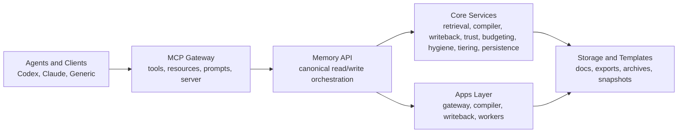

# Architecture Overview

This diagram summarizes the canonical runtime surfaces that remain stable through
Phase 15.

```mermaid
flowchart LR
    A["Agents and Clients<br/>Codex, Claude, Generic"] --> B["MCP Gateway<br/>tools, resources, prompts, server"]
    B --> C["Memory API<br/>canonical read/write orchestration"]
    C --> D["Core Services<br/>retrieval, compiler, writeback, trust, budgeting, hygiene, tiering, persistence"]
    D --> E["Storage and Templates<br/>docs, exports, archives, snapshots"]
    C --> F["Apps Layer<br/>gateway, compiler, writeback, workers"]
    F --> E
```
