# Phase 6–15 Integration Map

This diagram shows how the later phases extend retrieval, hygiene, governance,
runtime handoff, persistence, and observability without breaking canonical
module boundaries.

```mermaid
flowchart LR
    P6["Phase 6<br/>Retrieval Intelligence and Links"] --> P7["Phase 7<br/>Promotion, Dedupe, Hygiene"]
    P7 --> P8["Phase 8<br/>Governance and Trust"]
    P8 --> P9["Phase 9<br/>Cost and Performance"]
    P9 --> P10["Phase 10<br/>Operational Readiness"]
    P10 --> P11["Phase 11<br/>Persistent Storage and Replay"]
    P11 --> P12["Phase 12<br/>Runtime Connectors and Handoff"]
    P12 --> P13["Phase 13<br/>Multi-Agent Coordination"]
    P13 --> P14["Phase 14<br/>Policy and Approval Gates"]
    P14 --> P15["Phase 15<br/>Observability and Playbooks"]

    P6 --> S["Canonical services and APIs remain intact"]
    P11 --> S
    P15 --> S
```

