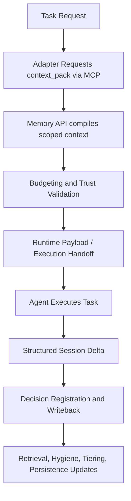

# Compile-to-Writeback Workflow

This workflow reflects the adapter contract: compile compact context, execute,
then write back structured deltas.

```mermaid
flowchart TD
    A["Task Request"] --> B["Adapter Requests context_pack via MCP"]
    B --> C["Memory API compiles scoped context"]
    C --> D["Budgeting and Trust Validation"]
    D --> E["Runtime Payload / Execution Handoff"]
    E --> F["Agent Executes Task"]
    F --> G["Structured Session Delta"]
    G --> H["Decision Registration and Writeback"]
    H --> I["Retrieval, Hygiene, Tiering, Persistence Updates"]
```
